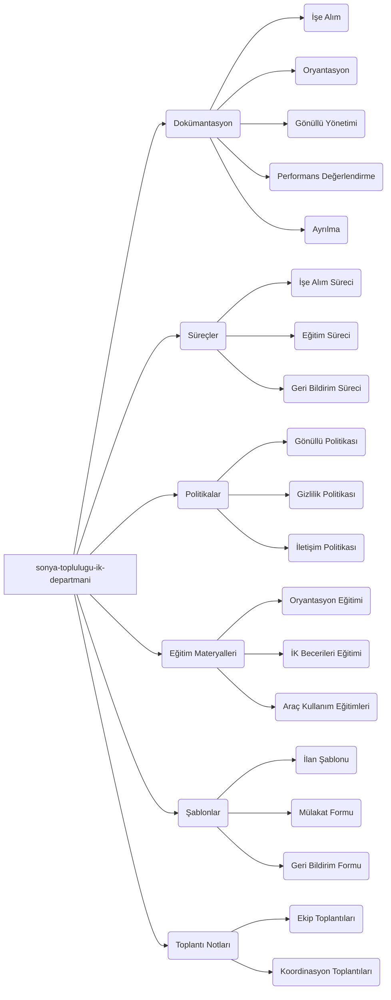

# Sonya Topluluğu İK Departmanı

Bu depo, Sonya Topluluğu İK departmanı için gerekli tüm dokümantasyonu, süreçleri, politikaları ve eğitim materyallerini içerir. Amacımız, gönüllü odaklı, sürdürülebilir ve etkili bir İK organizasyonu oluşturmaktır.

## İçindekiler

1.  [Depo Yapısı](#depo-yapısı)
2.  [Klasör Açıklamaları](#klasör-açıklamaları)
3.  [Katkıda Bulunma](#katkıda-bulunma)
4.  [Lisans](#lisans)

# Sonya Topluluğu İK Departmanı GitHub Deposu

Bu depo, Sonya Topluluğu İnsan Kaynakları (İK) departmanının tüm süreçlerini, belgelerini, politikalarını ve eğitim materyallerini barındırır. Amacı, gönüllülük esasına dayalı, sürdürülebilir, şeffaf ve kimseye ağır yük bindirmeyen bir İK yapısı oluşturmaktır.

## Amaç

* Topluluk İK faaliyetlerinin merkezi koordinasyon noktası olmak.
* Bilgiye kolay ve şeffaf erişim sağlamak.
* Gönüllülerin etkin katılımını ve gelişimini desteklemek.
* İK süreçlerinde devamlılığı ve sürdürülebilirliği sağlamak.

## Depo Yapısına Genel Bakış

Bu depo, aşağıdaki ana klasörler altında organize edilmiştir:

* 📄 **`01_Belgeler_ve_Politikalar/`**: İK süreçleri, prosedürleri, politikalar ve İK yönetimiyle ilgili temel belgeler.
* 🎓 **`02_Egitim_Materyalleri/`**: Gönüllüler için oryantasyon, beceri geliştirme ve araç kullanım eğitimleri.
* 📝 **`03_Sablonlar_ve_Formlar/`**: İK süreçlerinde kullanılacak standart formlar ve belge şablonları.
* ⚙️ **`04_Is_Akislari_ve_Sistemler/`**: İK süreçlerinin görselleştirilmiş iş akışları ve kullanılan sistemlere dair bilgiler. (.github klasörü altında Issue şablonları ve potansiyel otomasyonlar da yer alır.)
* 🗂️ **`06_Arsiv/`**: Güncelliğini yitirmiş veya tamamlanmış projelere ait belgeler.

## Bu Depo Nasıl Kullanılır?

* **Bilgi Arama:** İlgilendiğiniz konuya göre yukarıdaki klasör yapısını veya GitHub'ın arama özelliğini kullanabilirsiniz.
* **Süreç Takibi:** `01_Belgeler_ve_Politikalar/Süreçler_ve_Prosedürler/` altında ilgili süreci inceleyebilirsiniz.
* **Katkıda Bulunma:** Yeni bir belge eklemek, mevcut bir belgeyi güncellemek veya bir hata bildirmek için lütfen `CONTRIBUTING.md` dosyasını inceleyin.
* **Güncel Kalma:** Depoyu "Watch" ederek değişikliklerden haberdar olabilirsiniz.

## İletişim

İK Departmanı ile ilgili genel konular, öneriler veya sorularınız için öncelikli iletişim kanalımız **Element**'tir. İlgili İK ekibinin (örn: İşe Alım, Gönüllü İlişkileri) Element kanalını kullanabilirsiniz.

* İK Departmanı Genel Duyuru Kanalı (Element): `#sonya-ik-duyuru`

## Wiki

Daha detaylı bilgiler, sıkça sorulan sorular (SSS), toplantı notları ve İK departmanının genel işleyişine dair kapsamlı rehberler için lütfen [/docs](./docs) ziyaret edin.

## Depo Yapısı

---
Bu depoyu hep birlikte geliştirelim!
